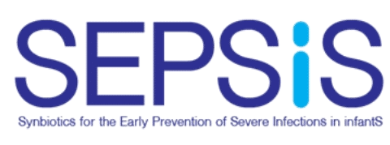
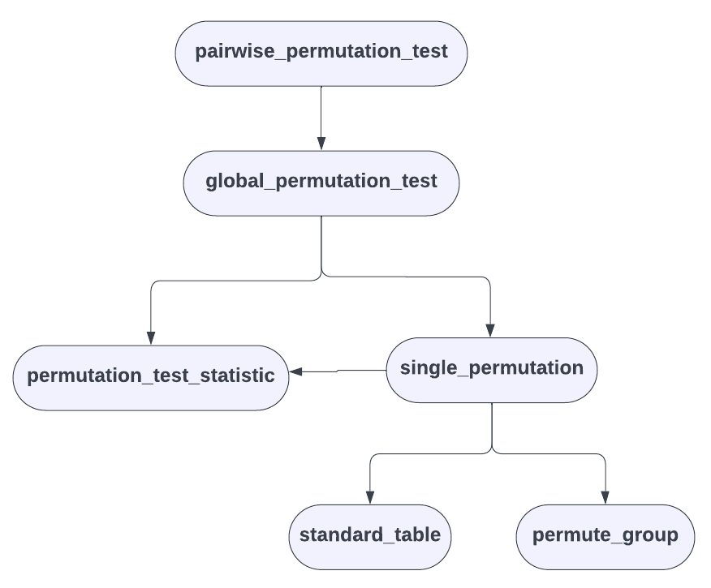

# The `SepsisTools` R package
This R package is a set of code chunks/functions that will be shared among analysts for global/pairwise permutation tests(and other needs). 

# Obectives
We aim to make sure that analysts are all using the same tested code, rather than simply trading code files back and forth. The advantages of packaging are
* Uniformity of analysis - less gotchas with small differences between analysts' individual work, and robustness to different coding styles,
* Versioning - one of the many benefits of using GitHub,
* Easier code review - a central source of code only needs to be verified once before general lab use.

# Collaborators
* Brendon Phillips (SickKids); brendon.phillips@sickkids.ca,
* Cole Heasley (SickKids); ,
* Miranda Loutet (SickKids); ,
* Celine Funk (SickKids); ,
* Daniel Roth (SickKids); ,
* Lisa Pell (SickKids); .

# Package Installation
The package is available via GitHub via the commands:
```r
# install the package
library(devtools)
devtools::install_github("brendonphillips/SepsisTools", force = TRUE)

# load the library
library(SepsisTools)
```

# Why a new package?
The test statistic that we have settled on is not covered by other packages; the closest is the 'General Independence Test' offered in the [R `coin` package](https://cran.r-project.org/web/packages/coin/index.html), which offers a quadratic form of test statistic. Being unclear about the statistic implemented, the team of analysts decided to maintain our own methods.

# **Functionality**

## Permutation Tests


### Motivation
For SEPSIS data sets, we realised that the Wald test fails when including groups with all-zeros (excluding these groups brings a host of problems, including questionable interpretation of the results), so we've gone with permutation tests, which we do both globally, and for pairwise comparisons between IP groups and placebo.
### Theory
...
### Implementation
These are the functions used in the package:
* `standard_table` - selects the group, event and id features from the table and applies standardised column names "group_", "event_" and "id_" in preparation for other functions. A data frame is returned.
* `permute_group` - randomly shuffles the groups to which events have been assigned in preparation for the "global_permutation_test" function. A data table giving both the original and permuted groups is output.
* `perm_test_statistic` - calculates the sum of squares difference between the group means and the overall mean. A numerical value is output.
* `single_permutation` - permutes the groups from the incoming data once (via "permute_groups") and calculates the test statistic (via "perm_test_statistic"). A numeric value is output.
* `global_permutation_test` - takes a set of $N_{\text{obs}}$ observations and for a specified number of iterations $N_\text{iter}$ (where $N_{\text{iter}}\le N_{\text{obs}}!$), permutes the groups of the data set, calculates $\max\left(N_{\text{iter}},  N_{\text{obs}}!\right)$ test statistics and returns the p-value. These permutation tests can be run either serially or in parallel. A list is output with the features:
    * `$p` - the p-value,
    * `error` - the Monte-Carlo error term,
    * `N_trials` - the number of permutation tests performed,
    * `N_obs` - the number of observations in the tested data set.
* `pairwise_permutation_test` - takes a data set with various groups, carries out a global permutation test (among all groups, if chosen by the user) and then calculates pairwise permutation tests between all combinations of some fixed groups and all of the other groups present in the data set. If chosen by the user, various family corrections can be carried out on the resulting p-values. All results are returned in a data frame. 

## Staffer Uniquification/Disambiguation
### Motivation
Aim 11 of the study involves finding potential sources of contamination of maternal and sibling stool samples. A part of our method involves analysing the behaviour of a staffer before the collection of an LP202195-positive sample; for this, we need each research staff in SEPSIS to be uniquely identifiable throughout all encounters in the data set. QA showed that in > 20 cases, the same staffer was represented by a range of ID numbers (up to 5, among all formatted encounter data sets available).

### Technique
Since ID numbers were paired with names, we used mangling and the [Jaro-Winkler string distance](https://en.wikipedia.org/wiki/Jaro%E2%80%93Winkler_distance) metric to create a string-matching algorithm that identified potential matches (that is, one staffer represented by multiple IDs). The output of this algorithm (with other data analysis) was evaluated with help from study collaborators in Bangladesh, allowing for the identification of duplicated IDs. For each set of duplicates (ie., for each staffer) a new "RLxxxxx" ID was created (<ins>R</ins>oth <ins>L</ins>ab)
### Implementation
The string matching process and algorithm are documented at length [here](https://sickkidsca-my.sharepoint.com/:w:/r/personal/brendon_phillips_sickkids_ca/Documents/Duplication%20of%20CHRW%20IDs%20across%20formatted%20files%20in%20the%20SEPSiS.docx?d=w273228faf9ee4a57bf38e9fb67357a26&csf=1&web=1&e=TObGy3). A data frame was created, where each staffer was matched to all their ID numbers through the study; a new ID was created with `encode_staffer_ids` algorithm, and a lookup table was assembled ("staffer_dictionary").

#### `encode_staffer_ids`
A new ID is created from an input string via the following process:
1. The name of the staffer is mangled (using the algorithm outlined [here](https://sickkidsca-my.sharepoint.com/:w:/r/personal/brendon_phillips_sickkids_ca/Documents/Duplication%20of%20CHRW%20IDs%20across%20formatted%20files%20in%20the%20SEPSiS.docx?d=w273228faf9ee4a57bf38e9fb67357a26&csf=1&web=1&e=TObGy3)),
2. An XXH128 hash of the mangled name is created with R's `rlang::hash` function,
3. The index and value of each digit in the has is recorded,
4. The two vectors are multiplied, and the result vector is randomly shuffled,
5. Every other element of the vector is selected,
6. The prefix "RL" is appended,
7. The string is truncated at seven characters.

This gives an ID with the standard format "RLxxxxx" (where x is a digit 0-9). T
### `uniquify_staffer_ids`
This function takes either a list or a data frame and looks up the new RL ID of every staffer in the data set.

# Data Sets
There are two data sets provided with the package.
### `class_performance`
This data set is meant to mimic the data sets seen in the SEPSIS study, and used to trial the functions relating to permutation testing. 
```r
data(class_performance) # load with
```
The data sets record the quizzes attempted by a number of students, their teachers, the quiz number, and whether they passed/failed. A sample follows: 

|student_id |class_teacher | quiz_number|passed_quiz | passed_quiz_numeric|passed_quiz_string |
|:----------|:-------------|-----------:|:-----------|-------------------:|:------------------|
|RL13020    |Grey          |           5|TRUE        |                   1|Yes                |
|RL13020    |Grey          |           9|TRUE        |                   1|Yes                |
|RL13020    |Grey          |          11|TRUE        |                   1|Yes                |
|RL13020    |Grey          |          12|TRUE        |                   1|Yes                |
|RL20429    |Simpson       |           7|TRUE        |                   1|Yes                |
|RL20429    |Simpson       |           8|TRUE        |                   1|Yes                |
|RL20429    |Simpson       |           5|TRUE        |                   1|Yes                |

There are 3618 records in the set, giving the TRUE/FALSE test results of 508 students split among 5 subjects taught by teachers with last names "Grey", "Simpson", "Cumberbatch", "Roth" and NA (for demonstration purposes). Examples for the `get_p_value`, `global_permutation_test`, `pairwise_permutation_tests`, `perm_test_statistics`, `permute_groups` and `permgp_fn` (deprecated). 

### `staffer_dictionary`
This is a lookup table mapping SEPSIS ID numbers to unique project "RL" numbers. It can be loaded with the command:
```r
# load with
data(class_performance)
```
Explained above.

# **Package Details**
### Design
We aim to write and code this package in the tidyverse style, though R files may not always be completely linted before committing. All changes to the main branch must be done through a pull request from a dedicated branch. 

## Maintenance
For issues, contact me on Teams and/or email me.

## Development Milestones (to present)
|     Date    |                    Action                   |        Contributor        | Note |
|:-----------:|:-------------------------------------------:|:-------------------------:|:----:|
| 25 Sep 2023 | Initial inquiry re: accounting for 0 values |         Lisa Pell         |      |
|  5 Oct 2023 |       Contribution of template R code       |    Eleanor Pullenayegum   |      |
| 10 Oct 2023 |        Adaptation of template R code        |        Cole Heasley       |      |
| 11 Oct 2023 |               Code completion               |      Brendon Phillips     |      |
| 17 Oct 2023 |              R package proposed             |      Brendon Phillips     |      |
| 23 Oct 2023 |          First draft of package finished    |      Brendon Phillips     |      |
| 25 Oct 2023 |              Package documented             |      Brendon Phillips     |      |
| 26 Oct 2023 | problems with `ranseed` arguments fixed     |  Brendon Phillips         | change necessitated by change to parameter names, `get_p_value_function` renamed to `single_permutation`  |
| 26 Oct 2023 | staffer_dictionary amended after review | Brendon Phillips | staffer name similarity dismissed as coincidence, dictionary regenerated |
|   ongoing   |                   testing                   | Cole Heasley, Celine Funk |      |

## Dependencies
* `dplyr` - .data, all_of, as_tibble, bind_rows, case_when, group_by, join_by, left_join. mutate, n, pull, rename, rename_with, right_join, rowwise, select, summarise, tibble, ungroup,
* `foreach` - %do%, %dopar%, foreach,
* `data.table` - fread, rbindlist,
* `doSNOW` - registerDoDNOW,
* `haven` - read_dta,
* `lazyeval` - lasy_dots,
* `parallel` - detectCores, makeCluster, stopCluster,
* `plyr` - rbind.fill,
* `purrr` - map, reduce,
* `readxl` - read_excel,
* `rlang` - hash,
* `stats` - p.adjust

## Decisions (Analysts)
1. Packages can be added over time; as of right now, no other code is of general use to the lab, other than the permutation tests and the staffer ID uniquification.
2. We will maintain the package in a public repository, given that none of the routines expose sensitive information, or could possibly lead to deanonymisation.

## Sources
SEPSIS data (Microsoft 365), personal communication amongst the ANalysis team.

## To-do
* better implementation for `ranseed` argument
* access to `permute_groups` and `standard_tble` functions during parallel execution
* `na_fill` adgument for lists in `encode_staffer_ids` 
* histogram of test statistics during permutation tests

## Licence
We use the [MIT](https://choosealicense.com/licenses/mit/) licence.
